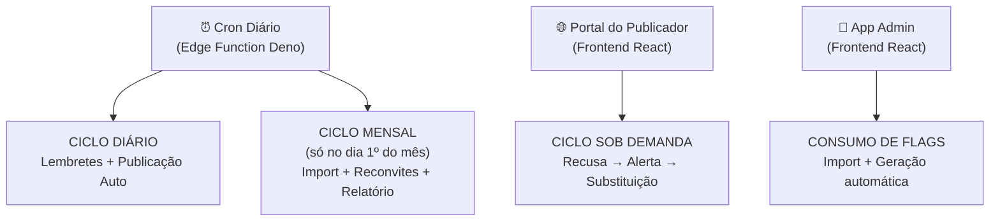
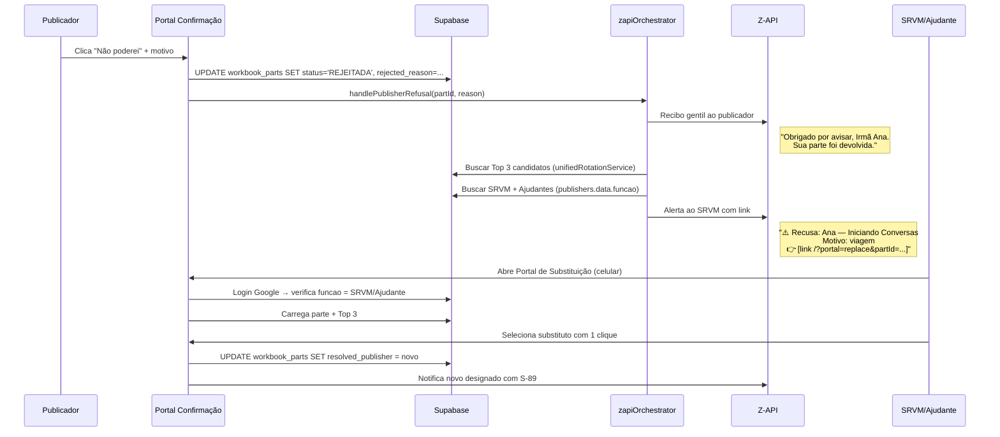
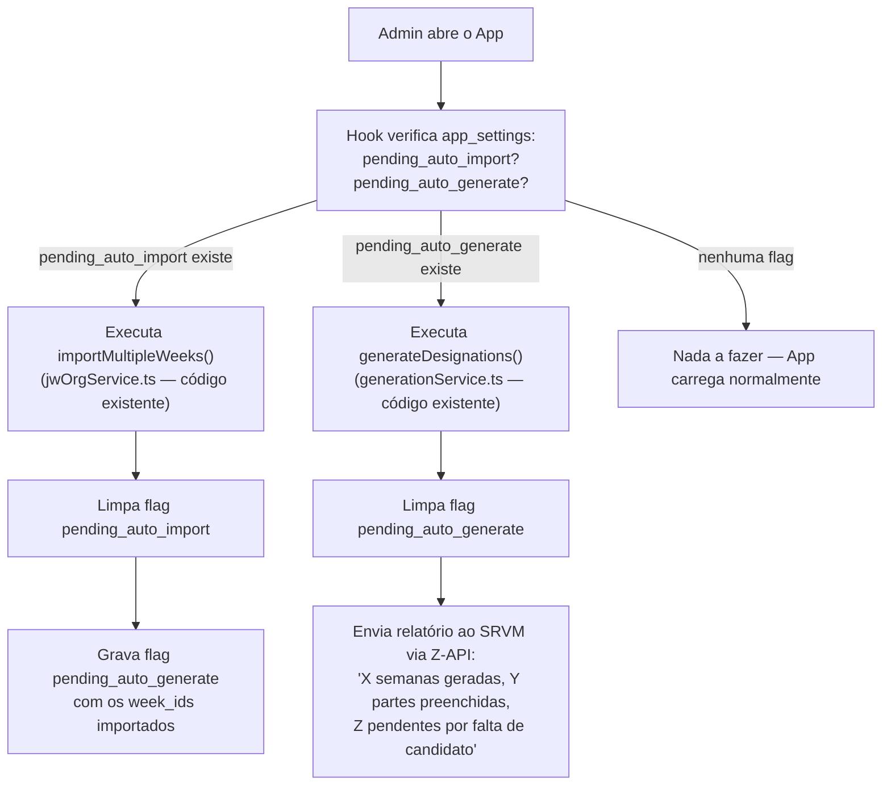

# Fluxo Completo: Cron → Z-API → App

> Documento de clareza arquitetural. **Não é código.** Descreve o algoritmo completo após todas as mudanças do plano.

---

## Visão Geral — Os 3 Ciclos



---

## CICLO 1: Diário (Cron roda todo dia)

### Passo 0 — Segurança
```
SE zapi_automation_active ≠ true → ABORTA (kill-switch global)
```

### Passo 1 — Carregar Dados
```
1. Ler app_settings.s89_meeting_day_by_week → { "2026-06-15": 5, ... }
2. Buscar workbook_parts WHERE status IN ('DESIGNADA','PROPOSTA')
3. Buscar publishers (id, data jsonb → name, phone, gender, funcao, condition, privileges)
4. Data de hoje (UTC, truncada à meia-noite)
```

### Passo 2 — Para cada parte, calcular distância
```
PARA CADA parte:
  │
  ├─ Calcular meetingDate usando week_id + meetingDays[week_id] (fallback 4)
  ├─ diffDays = meetingDate - hoje (em dias)
  │
  ├─ FILTRO DE RUÍDO: Ignorar se tipo_parte IN:
  │   (Cântico*, Oração Inicial, Comentários Iniciais,
  │    Comentários Finais, Elogios e Conselhos)
  │   → CONTINUE (próxima parte)
  │   ⚠️ Oração Final e Presidente NÃO são filtrados — são designáveis
  │
  ├─ BLOQUEIO MESTRE: Verificar se S-89 foi enviado para esta parte
  │   Consultar zapi_dispatch_log WHERE part_id = X AND dispatch_type = 'PUBLICACAO_S89' AND status = 'SUCCESS'
  │   SE NÃO encontrou → esta parte nunca foi oficialmente publicada → CONTINUE
  │
  ├─ DETERMINAR AÇÃO pelo diffDays:
  │
  │   diffDays = 9 → COBRANÇA D-9
  │     Condição: status = 'PROPOSTA' (ignorou o S-89)
  │     Ação: Enviar link mágico de confirmação/recusa
  │     dispatch_type = 'COBRANCA_D9'
  │
  │   diffDays = 7 → LEMBRETE D-7
  │     Condição: status = 'DESIGNADA'
  │       OU (status = 'PROPOSTA' E publicador.condition IN ('Ancião','Servo Ministerial')) ← Aquiescência
  │     Ação: Enviar lembrete com parceiro de ensaio (se existir)
  │     dispatch_type = 'LEMBRETE_D7'
  │
  │   diffDays = 2 → LEMBRETE D-2
  │     Mesma condição do D-7
  │     Ação: Enviar lembrete final
  │     dispatch_type = 'LEMBRETE_D2'
  │
  │   Qualquer outro diffDays → CONTINUE (nada a fazer)
  │
  ├─ IDEMPOTÊNCIA: Checar zapi_dispatch_log (part_id + dispatch_type)
  │   SE já enviado com SUCCESS → CONTINUE
  │
  ├─ RESOLVER TELEFONE: resolved_publisher_id → publishers.data.phone
  │   Fallback: match por nome
  │   SE sem telefone → agregar na lista "sem_telefone" → CONTINUE
  │
  ├─ CONSTRUIR MENSAGEM:
  │   Saudação: hora de Brasília → "Bom dia" / "Boa tarde" / "Boa noite"
  │   Gênero: publishers.data.gender → "Irmão" / "Irmã"
  │   Data textual: "sexta-feira, 20 de junho"
  │   Template por tipo de parte (ministério, leitura, discurso, etc.)
  │   Se D-7 e existe par Titular/Ajudante → incluir nome e contato do parceiro
  │
  ├─ ENVIAR via send-whatsapp Edge Function
  └─ REGISTRAR no zapi_dispatch_log
```

### Passo 3 — Auto-Publicação D-15
```
Buscar semanas com status 'LIBERADA' (campo novo: week_publication_status em app_settings)
  OU semanas publicadas manualmente (já possuem partes com status DESIGNADA/PROPOSTA)

PARA CADA semana liberada:
  │
  ├─ Calcular diffDays = meetingDate - hoje
  ├─ SE diffDays ≤ 15:
  │   │
  │   ├─ PARA CADA parte designável da semana:
  │   │   ├─ Gerar mensagem S-89 (convocação com link mágico)
  │   │   ├─ Enviar via Z-API
  │   │   └─ Registrar dispatch_type = 'PUBLICACAO_S89'
  │   │
  │   ├─ Marcar semana como 'PUBLICADA'
  │   └─ Enviar relatório ao SRVM e Ajudantes:
  │       "✅ Semana de 20/jun publicada. X publicadores notificados."
```

### Passo 4 — Relatório Diário
```
Compilar resumo do dia:
  - Quantos lembretes D-7 enviados
  - Quantos lembretes D-2 enviados
  - Quantas cobranças D-9 enviadas
  - Quantas publicações D-15 realizadas
  - Lista de partes sem telefone (Passo 2, acumulado)

Buscar SRVM e Ajudante via publishers.data.funcao:
  funcao = 'Superintendente da Reunião Vida e Ministério'
  funcao = 'Ajudante do Superintendente da Reunião Vida e Ministério'

Enviar relatório consolidado para cada um via Z-API
```

---

## CICLO 2: Mensal (Cron roda, mas blocos mensais só executam no dia 1º)

```
SE hoje.getDate() ≠ 1 → PULAR ciclo mensal
```

### Bloco M1 — Sinalizar Import de Apostilas
```
1. Listar week_ids dos próximos 60 dias (seg de cada semana)
2. Consultar workbook_parts para ver quais week_ids JÁ existem no banco
3. Diferença = semanas que FALTAM (não importadas ainda)
4. SE diferença > 0:
   │
   ├─ Gravar flag em app_settings:
   │   key = 'pending_auto_import'
   │   value = { weeks: ["2026-08-03","2026-08-10",...], requested_at: "ISO" }
   │
   └─ Enviar Z-API ao SRVM:
       "📥 Há X semanas novas disponíveis no jw.org.
        Abra o sistema para importação automática."
```
> ⚠️ O Cron NÃO importa. Ele só sinaliza. O frontend consome a flag.

### Bloco M2 — Reconvite: "Pediu para não participar"
```
Buscar publishers WHERE data->>'requestedNoParticipation' = 'true'
  AND data->>'phone' IS NOT NULL

PARA CADA publicador:
  ├─ Checar idempotência: dispatch_type = 'RECONVITE_MENSAL_' + YYYY-MM
  ├─ SE já enviado → CONTINUE
  ├─ Gerar token temporário (UUID, 30 dias de validade)
  ├─ Enviar mensagem gentil:
  │   "Irmã Maria, gostaríamos de saber se já se sente à vontade
  │    para voltar a receber designações. Se quiser, clique aqui:
  │    [link /?portal=preferences&action=rejoin&token=...]"
  └─ Registrar no dispatch_log
```

### Bloco M3 — Reconvite: "Só Ajudante"
```
Mesma lógica do M2, mas filtro:
  data->>'isHelperOnly' = 'true'
  dispatch_type = 'RECONVITE_HELPER_' + YYYY-MM
  Link: /?portal=preferences&action=full-participation&token=...
  Mensagem: "...considerar também fazer partes como titular..."
```

### Bloco M4 — Relatório à Comissão de Serviço
```
Buscar lista de:
  A) publishers WHERE data->>'isNotQualified' = 'true' (impedidos)
  B) publishers WHERE data->>'requestedNoParticipation' = 'true' (optaram sair)
  C) publishers WHERE data->>'isHelperOnly' = 'true' (só ajudante)

Buscar membros da comissão:
  funcao IN ('Coordenador do Corpo de Anciãos', 'Secretário',
             'Superintendente de Serviço',
             'Superintendente da Reunião Vida e Ministério')

Enviar para cada membro (exceto Ajudante SRVM, salvo se Ancião):
  "📋 Relatório Mensal — Revisão de Status
   
   ⛔ Impedidos (X):
   • João — Motivo: [notQualifiedReason]
   • Maria — Motivo: ...
   
   🚫 Pediram para não participar (Y):
   • Ana — Motivo: [noParticipationReason]
   
   🤝 Apenas ajudante (Z):
   • Maria Marques
   
   Por favor, considerem rever estes status.
   Há alguém qualificado que possa ser adicionado?
   🔗 [link para PublisherStatusForm]"
```

---

## CICLO 3: Sob Demanda (Frontend — quando publicador recusa)



---

## CICLO 4: Consumo de Flags (Frontend — quando Admin abre o app)



**Detalhe importante:** O frontend usa `importMultipleWeeks()` (linha 594, `jwOrgService.ts`) e `generationService.generateDesignations()` (linha 109) — funções que **já existem e já são chamadas** pelo Agent Chat e pelo WorkbookImportModal. Zero código novo de lógica.

---

## Linha do Tempo Completa — Vida de uma Designação

```
MÊS ANTERIOR
│
├─ Dia 1º: Cron sinaliza flag "pending_auto_import"
│          Cron envia reconvites (M2, M3)
│          Cron envia relatório à comissão (M4)
│
├─ Admin abre app: Frontend consome flag
│   ├─ Importa apostilas do jw.org (5.1)
│   ├─ Gera designações automáticas — status PROPOSTA (5.4)
│   └─ Avisa SRVM: "Semanas prontas para revisão"
│
├─ SRVM revisa, ajusta, e clica "Liberar para Auto-Publicação"
│   (ou usa "Publicar Semana" manual — ambos funcionam)
│
│
SEMANA DA REUNIÃO
│
├─ D-15: Cron detecta semana Liberada/Publicada
│         Envia S-89 (convocação) a todos os designados
│         dispatch_type = 'PUBLICACAO_S89'
│         Avisa SRVM: "Semana publicada para X irmãos"
│
├─ D-9:  Cron cobra quem tem status PROPOSTA (não respondeu)
│         Envia link mágico para confirmar/recusar
│         dispatch_type = 'COBRANCA_D9'
│
├─ D-7:  Cron envia lembrete de ensaio
│         Só para DESIGNADA ou Aquiescência (Ancião/SM com PROPOSTA)
│         Inclui parceiro de ensaio (se existir)
│         dispatch_type = 'LEMBRETE_D7'
│
├─ D-2:  Cron envia último lembrete
│         dispatch_type = 'LEMBRETE_D2'
│
├─ A QUALQUER MOMENTO: Publicador recusa via portal
│   ├─ Recebe recibo gentil no WhatsApp
│   ├─ SRVM recebe alerta + link para Portal de Substituição
│   └─ SRVM seleciona substituto em 1 clique no celular
│
└─ DIA DA REUNIÃO: ✅ Tudo resolvido automaticamente
```

---

## Tabelas e Chaves Envolvidas

| Tabela | Chave | Quem Grava | Quem Lê |
|--------|-------|-----------|---------|
| `app_settings` | `s89_meeting_day_by_week` | Modal S-89 (UI) | Cron |
| `app_settings` | `pending_auto_import` | Cron (mensal) | Frontend (on-mount) |
| `app_settings` | `pending_auto_generate` | Frontend (pós-import) | Frontend (on-mount) |
| `settings` | `zapi_automation_active` | Admin Dashboard (UI) | Cron (kill-switch) |
| `zapi_dispatch_log` | `part_id + dispatch_type` | Cron / zapiOrchestrator | Cron (idempotência) |
| `workbook_parts` | `status`, `week_id` | Cron / Frontend / Portal | Cron / Frontend |
| `publishers` | `data.funcao` | Admin (UI) | Cron (destinatários) |
| `publishers` | `data.requestedNoParticipation` | Admin / PreferencesPortal | Cron (reconvite mensal) |
| `publishers` | `data.isHelperOnly` | Admin / PreferencesPortal | Cron (reconvite mensal) |
| `publishers` | `data.isNotQualified` | Admin (UI) | Cron (relatório comissão) |
