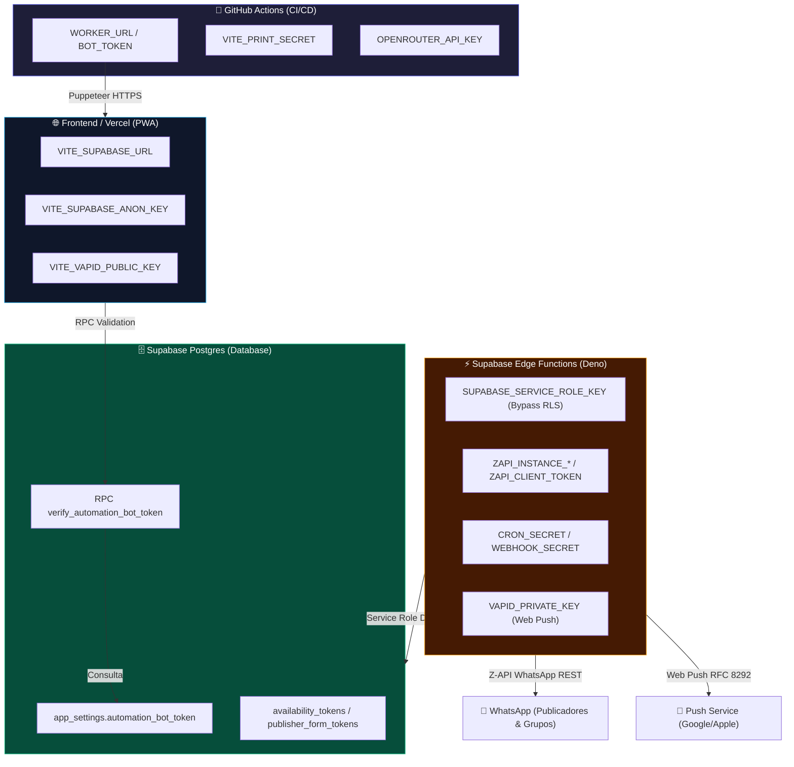
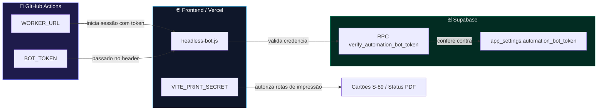
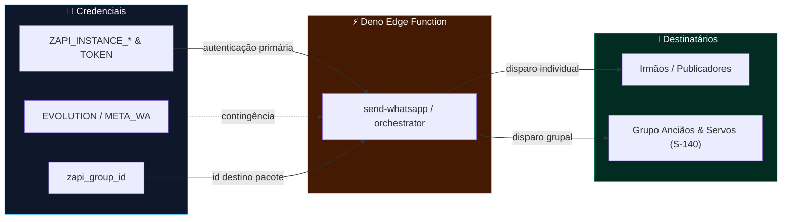
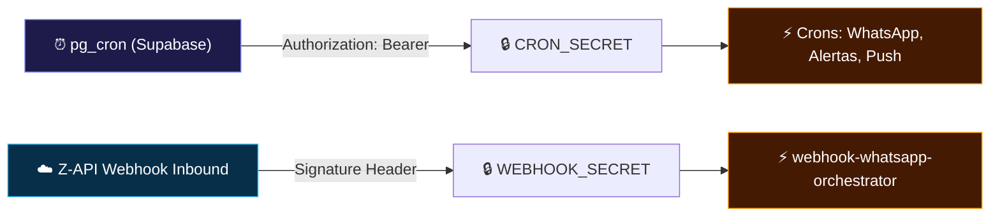
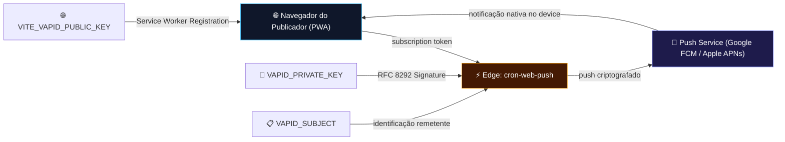
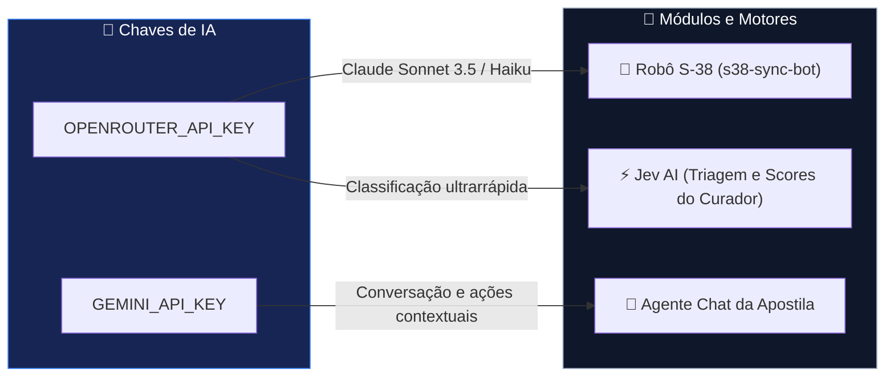
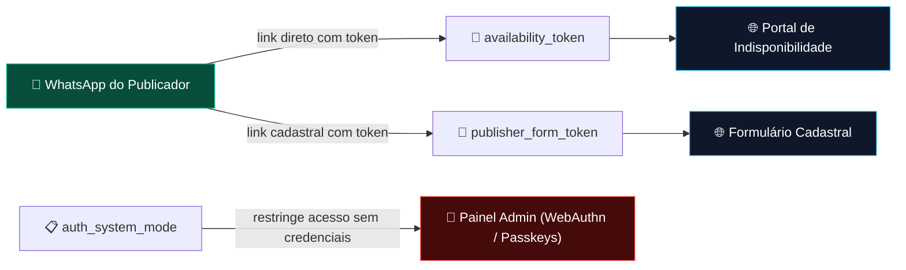

# Levantamento Canônico de Secrets, Tokens e Credenciais — RVM Designações

> **Data da Auditoria:** 03 de Outubro de 2026  
> **Status do Ecossistema:** 100% Auditado e Conciliado  
> **Escopo:** GitHub Actions, Supabase (Banco e Edge Functions), Vercel Serverless, PWA Push e Scripts de Background.

---

## 1. Topologia Geral de Credenciais e Privilégios

O ecossistema **RVM Designações** adota o princípio de privilégio mínimo e isolamento estrito de domínios:
1. **PWA / Frontend:** Acesso exclusivo a chaves públicas anônimas com RLS (`VITE_SUPABASE_ANON_KEY`, `VITE_VAPID_PUBLIC_KEY`).
2. **Backend & Edge Functions:** Mantêm chaves mestras (`SUPABASE_SERVICE_ROLE_KEY`, `ZAPI_*`, `VAPID_PRIVATE_KEY`) isoladas no Deno Runtime.
3. **CI/CD & Headless Puppeteer:** Executam rotinas sem supervisão utilizando credenciais específicas validadas via RPC `SECURITY DEFINER`.



---

## 2. Levantamento Detalhado por Camada de Arquitetura

Cada camada a seguir combina a **tabela com colunas alinhadas tipo planilha** (legível diretamente no editor de texto puro e renderizada nativamente no Preview) acompanhada pelo seu **diagrama de fluxo Mermaid**.

---

### 2.1 Camada 1: Automação Headless e CI/CD (GitHub Actions)

| Chave / Secret         | Classificação | Origem                 | Consumidor e Objetivo                                                          | Status Atual  |
|:-----------------------|:--------------|:-----------------------|:-------------------------------------------------------------------------------|:--------------|
| `WORKER_URL`           | 🔒 Secreta    | GitHub Secrets         | URL completa do Worker com token chamada pelo headless-bot.js para D-30 e D-21 | ✅ Alinhada   |
| `BOT_TOKEN`            | 🔒 Secreta    | GitHub Secrets         | Token de autenticação passado nos cabeçalhos e validado via RPC no Supabase    | ✅ Ativa      |
| `automation_bot_token` | 🔒 Secreta    | Supabase (app_settings)| Chave mestre segura no banco para validar se a requisição do bot é autorizada  | ✅ Sincronizado|
| `VITE_PRINT_SECRET`    | 🔒 Secreta    | GitHub / Vercel        | Protege rotas off-screen para renderização de cartões S-89 e PDFs de status   | ✅ Operacional|
| `GITHUB_PAT`           | 🚨 Crítica    | Supabase Edge Secrets  | Dispara workflows no GitHub Actions via API REST em resposta a eventos         | ✅ Ativa      |
| `GITHUB_TOKEN`         | 🔒 Restrita   | Vercel Environment     | Gravação e despachos atômicos no repositório via API Serverless                | ✅ Ativa      |



---

### 2.2 Camada 2: Banco de Dados e Backend (Supabase & Postgres)

| Chave / Secret             | Classificação        | Origem                  | Consumidor e Objetivo                                                      | Status Atual   |
|:---------------------------|:---------------------|:------------------------|:---------------------------------------------------------------------------|:---------------|
| `VITE_SUPABASE_URL`        | 🌐 Pública           | GitHub / Vercel / .env  | Endpoint base REST/Realtime (`••••••••••••••••••••.supabase.co`)            | ✅ Operacional |
| `VITE_SUPABASE_ANON_KEY`   | 🌐 Pública (Anon)    | GitHub / Vercel / .env  | Acesso padrão do cliente PostgREST estritamente limitado por políticas RLS | ✅ Operacional |
| `SUPABASE_SERVICE_ROLE_KEY`| 🚨 Altamente Crítica | Supabase Edge Secrets   | Acesso irrestrito com bypass de RLS nas Edge Functions e crons do sistema  | ✅ Isolada     |
| `RM_DATABASE_URL`          | 🚨 Altamente Crítica | .env local              | Conexão TCP direta com usuário postgres para cargas massivas do Glide      | ✅ Apenas Local|

```mermaid
flowchart LR
    subgraph PUBLIC["🌐 Acesso Público / Frontend"]
        URL["VITE_SUPABASE_URL"]
        ANON["VITE_SUPABASE_ANON_KEY"]
    end
    subgraph PRIVATE["🔒 Acesso Privado / Servidor"]
        SRV["SUPABASE_SERVICE_ROLE_KEY"]
        RM["RM_DATABASE_URL"]
    end
    subgraph CORE["🗄️ Supabase Postgres"]
        RLS["Camada de Políticas RLS"]
        DATA["Tabelas do Sistema"]
    end

    PUBLIC -->|requisições com RLS| RLS
    RLS --> DATA
    SRV -->|bypass RLS (Edge & Crons)| DATA
    RM -->|TCP direto port 5432| DATA

    style PUBLIC fill:#082f49,stroke:#0284c7,color:#fff
    style PRIVATE fill:#450a0a,stroke:#ef4444,color:#fff
    style CORE fill:#022c22,stroke:#059669,color:#fff
```

---

### 2.3 Camada 3: Comunicação e Mensageria (WhatsApp / Z-API / Provedores)

| Chave / Secret              | Classificação        | Origem                  | Consumidor e Objetivo                                                      | Status Atual       |
|:----------------------------|:---------------------|:------------------------|:---------------------------------------------------------------------------|:-------------------|
| `ZAPI_INSTANCE_* & TOKEN`   | 🔒 Secreta           | Supabase Edge Secrets   | Autenticação na API oficial Z-API para envio de mensagens, cartões e PDFs  | ✅ Ativa Produção  |
| `zapi_group_id`             | 📋 Configuração      | app_settings / settings | ID do grupo de Anciãos e Servos para envio automático dos Pacotes S-140    | ✅ Sincronizado    |
| `EVOLUTION_* / META_WA_*`   | 🔒 Standby           | Supabase Edge Secrets   | Provedores alternativos (Evolution API e Meta Cloud) para contingência     | ⏸️ Contingência    |



---

### 2.4 Camada 4: Segurança de Crons e Webhooks (Edge Functions)

| Chave / Secret   | Classificação           | Origem                 | Consumidor e Objetivo                                                      | Status Atual |
|:-----------------|:------------------------|:-----------------------|:---------------------------------------------------------------------------|:-------------|
| `CRON_SECRET`    | 🔒 Secreta (Anti-Abuso) | Supabase Edge Secrets  | Impede que chamadas HTTP externas sem autorização invoquem os crons diários | ✅ Ativa     |
| `WEBHOOK_SECRET` | 🔒 Secreta              | Supabase Edge Secrets  | Validação de assinatura criptográfica dos webhooks inbound da Z-API        | ✅ Ativa     |



---

### 2.5 Camada 5: Notificações Web Push (PWA)

| Chave / Secret          | Classificação        | Origem                 | Consumidor e Objetivo                                                      | Status Atual   |
|:------------------------|:---------------------|:-----------------------|:---------------------------------------------------------------------------|:---------------|
| `VITE_VAPID_PUBLIC_KEY` | 🌐 Pública           | Vercel / .env.local    | Permite ao Service Worker registrar a assinatura Push no navegador         | ✅ Operacional |
| `VAPID_PRIVATE_KEY`     | 🚨 Altamente Crítica | Supabase Edge Secrets  | Assina digitalmente o payload RFC 8292 enviado para Google FCM e Apple APNs| ✅ Isolada     |
| `VAPID_SUBJECT`         | 📋 Metadado RFC      | Supabase Edge Secrets  | Identificação de contato do remetente das notificações (`mailto:...`)       | ✅ Operacional |



---

### 2.6 Camada 6: Inteligência Artificial (Curador, S-38 e Agente)

| Chave / Secret       | Classificação | Origem                 | Consumidor e Objetivo                                                      | Status Atual   |
|:---------------------|:--------------|:-----------------------|:---------------------------------------------------------------------------|:---------------|
| `OPENROUTER_API_KEY` | 🔒 Secreta    | GitHub / .env.local    | Roteador unificado para modelos de ponta (Claude Sonnet 3.5, Haiku, Jev AI)| ✅ Ativa       |
| `GEMINI_API_KEY`     | 🔒 Secreta    | GitHub / Vercel / .env | Alimenta o Agente inteligente no chat e execução de ações rápidas no painel| ✅ Operacional |



---

### 2.7 Camada 7: Tokens Dinâmicos de Portais Públicos (Sem Login)

| Chave / Secret            | Classificação      | Origem                 | Consumidor e Objetivo                                                      | Status Atual        |
|:--------------------------|:-------------------|:-----------------------|:---------------------------------------------------------------------------|:--------------------|
| `availability_tokens`     | 🎫 Token Temporário| Supabase (app_settings)| Link público seguro para marcar indisponibilidade pastoral sem precisar de senha | ✅ Ativo            |
| `publisher_form_tokens`   | 🎫 Token Temporário| Supabase (app_settings)| Link público assinado para atualização de dados cadastrais e telefone      | ✅ Ativo            |
| `auth_system_mode`        | 📋 Política Mestre | app_settings           | Define a política de autenticação primária da liderança (WebAuthn Passkeys) | ✅ device_biometric |



---

## 3. Registro Histórico da Auditoria (03/10/2026)

* **Incidente Identificado:** O workflow `headless-bot.yml` falhava desde 26/09/2026 em 35 segundos com o erro `❌ Token inválido ou não autorizado (da48••••••)`.
* **Causa Raiz:** O segredo `WORKER_URL` no GitHub Actions continha um token legado de agosto (`da48••••••`), enquanto a migração do Supabase havia padronizado a credencial para `rvm_bot_••••••••••••••••••••••••`.
* **Resolução Aplicada:**
  1. Segredo `WORKER_URL` atualizado no GitHub Actions via GitHub CLI (`gh secret set WORKER_URL`).
  2. Segredo `BOT_TOKEN` provisionado no GitHub Actions (`gh secret set BOT_TOKEN`).
  3. Fila de publicação D-21 da semana de 19/10/2026 destravada para o ciclo matinal das 09:30 BRT.
