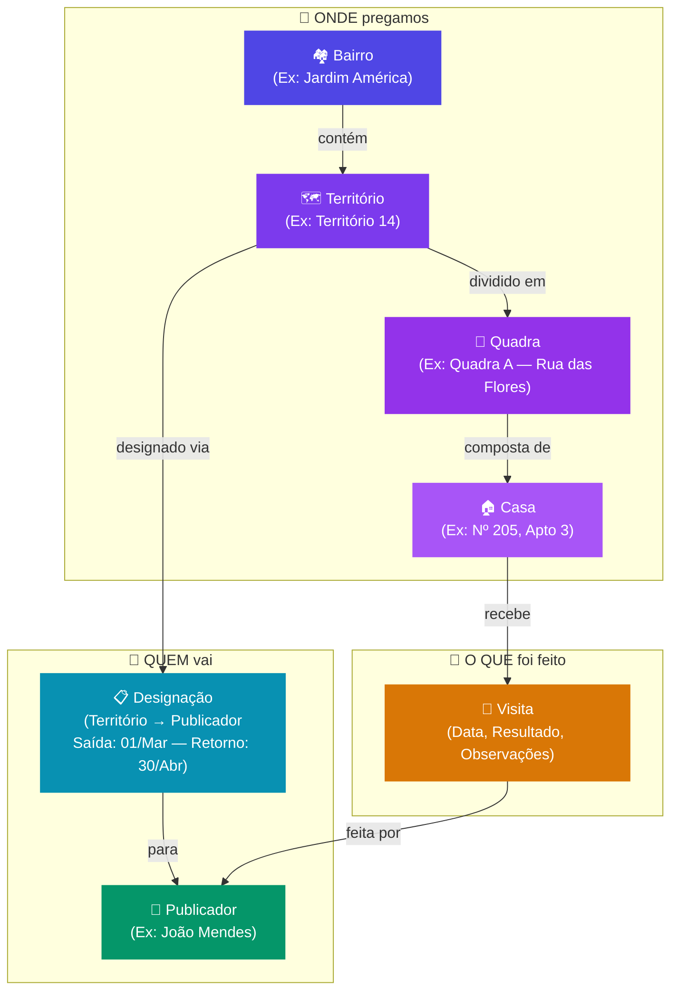
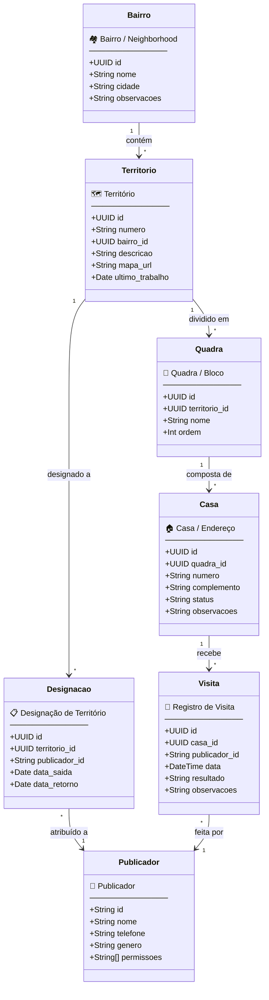
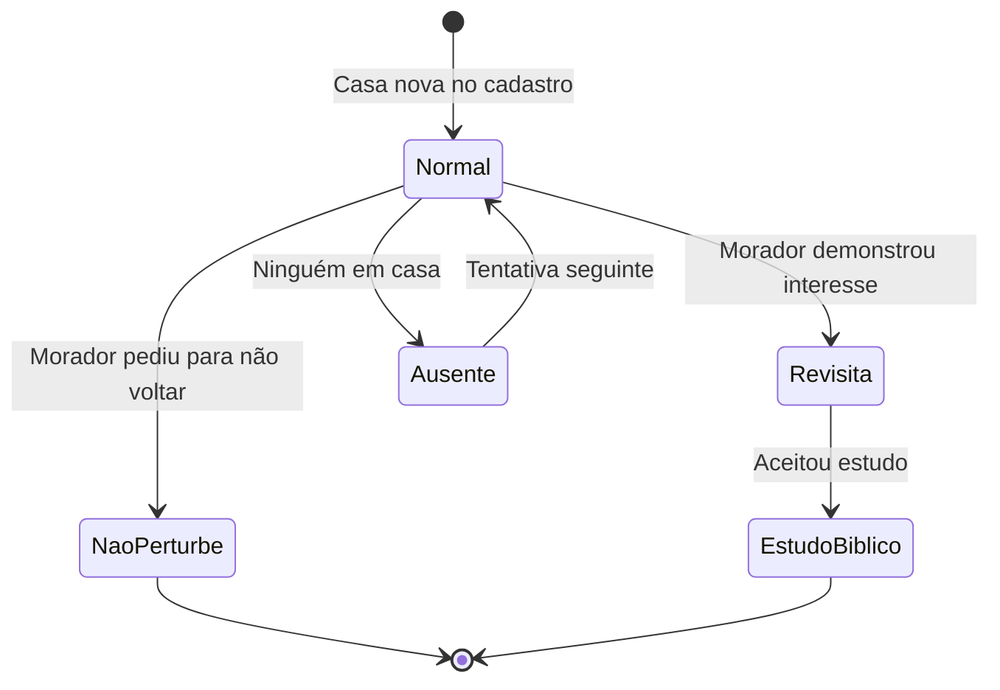
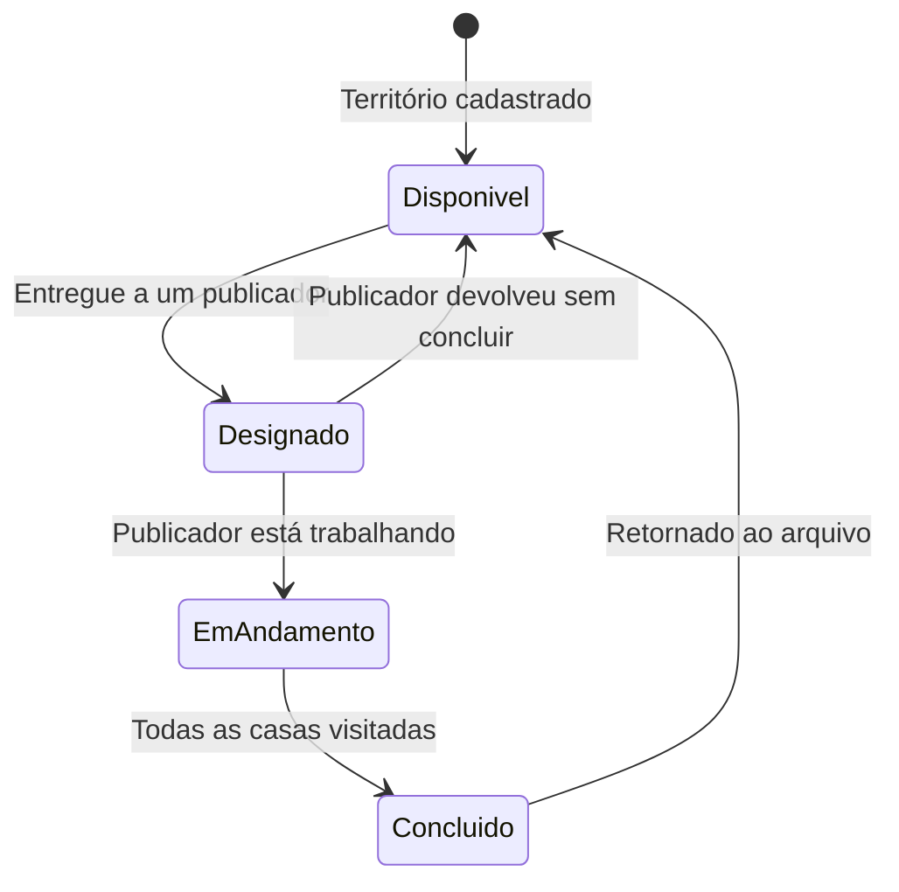

# 🌍 Controle de Trabalho de Campo — Modelo de Entidades

## Visão Geral (Leigo)

O sistema organiza o **trabalho de pregação** da congregação em camadas:

> **Onde** pregamos → **Quem** vai → **O que** foi feito

---

## Diagrama de Classes (UML Detalhado)

---

## Glossário para Leigos

| Entidade | O que é? | Exemplo Real |
|---|---|---|
| **Bairro** | A região geográfica que a congregação cobre | Jardim América, Centro, Vila Nova |
| **Território** | Uma subdivisão numerada do bairro, geralmente com mapa impresso | Território 14 — Jardim América Norte |
| **Quadra** | Um bloco de ruas/casas dentro do território | Quadra A — Rua das Flores até Rua dos Ipês |
| **Casa** | Um endereço específico dentro da quadra | Nº 205, Apto 3 |
| **Publicador** | O irmão ou irmã que realiza o trabalho de campo | João Mendes |
| **Designação** | O ato de entregar um território para um publicador trabalhar | "João, aqui está o Território 14. Retorne em 4 meses." |
| **Visita** | O registro do que aconteceu em cada casa | "Falei com morador, deixei convite. Revisita marcada." |

---

## Status de uma Casa

---

## Ciclo de Vida de um Território

---

## Mapeamento Banco ↔ Modelo

| Classe (Modelo) | Tabela (Supabase) | Status |
|---|---|---|
| Bairro | `neighborhoods` | ✅ Criada (0 linhas) |
| Território | `territories` | ✅ Criada (0 linhas) |
| Quadra | `blocks` | ✅ Criada (0 linhas) |
| Casa | `houses` | ✅ Criada (0 linhas) |
| Visita | `visits` | ✅ Criada (0 linhas) |
| Designação | `territory_assignments` | ✅ Criada (0 linhas) |
| Publicador | `publishers` | ✅ Existente (123 linhas) |

> [!NOTE]
> Todas as tabelas de território já existem no banco com RLS ativado e chaves estrangeiras configuradas. Falta apenas a **interface** (frontend) para gerenciá-las.
