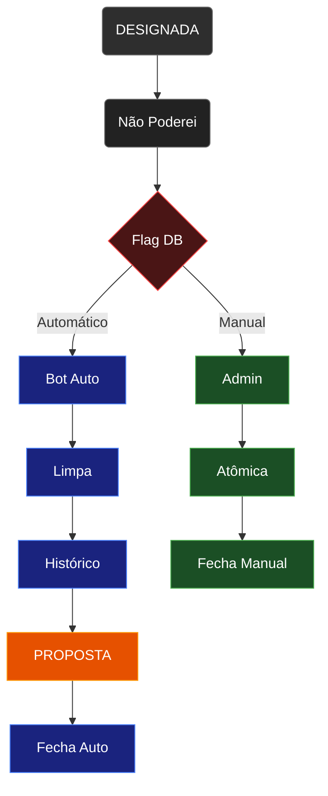

# Validação: `fluxo_status_troca.excalidraw` vs Código Fonte

## Fluxo Descrito no Diagrama



### Legenda dos Nós

| Nó | Descrição completa |
|---|---|
| **A** — DESIGNADA | Estado original da parte no banco |
| **B** — Não Poderei | Publicador clica ❌ "Não Poderei" via Z-API WhatsApp |
| **C** — Flag DB | `needs_reassignment = true`, status continua DESIGNADA |
| **D** — Bot Auto | 🤖 GitHub Actions Headless Bot → `executeAutoReassignment()` |
| **E** — Limpa | 🧹 Motor limpa parte → status temporário `PENDENTE` |
| **F** — Histórico | 📊 Cálculo de histórico + busca de elegíveis (`getRankedEligibleForPart`) |
| **G** — PROPOSTA | 🔄 Motor sugere substituto → status muda para `PROPOSTA` |
| **H** — Fecha Auto | ✅ `needs_reassignment=false`, `is_substitution=true` |
| **I** — Admin | 🚨 Admin vê sirene vermelha e abre Painel de Troca manual |
| **J** — Atômica | 🔧 Sobrescrita atômica via `directExecutePublisherUpdate()` |
| **K** — Fecha Manual | ✅ Status → `DESIGNADA`, `needs_reassignment=false`, `is_substitution=true` |


## Resultado da Validação

| # | Nó do Diagrama | Afirmação | Verdade no Código? | Veredito |
|---|---|---|---|---|
| C | "Status continua: **DESIGNADA**" | Ao clicar "Não Poderei", o status permanece DESIGNADA | ❌ **INCORRETO** | O webhook seta `status: "REJEITADA"` |
| C | `needs_reassignment = true` | Flag é setada | ✅ Correto | [zapi-smart-webhook/index.ts:622](file:///c:/Antigravity%20-%20RVM%20Designações/rvm-designacoes-unified/supabase/functions/zapi-smart-webhook/index.ts#L618-L627) |
| D | Gatilho: GitHub Actions Bot | Bot headless dispara `executeAutoReassignment` | ✅ Correto | [auto-reassign-bot.ts:80](file:///c:/Antigravity%20-%20RVM%20Designações/rvm-designacoes-unified/scripts/auto-reassign-bot.ts#L80-L85) |
| E | Limpeza → `PENDENTE` | `reassignParts` limpa a parte com `status: 'PENDENTE'` | ✅ Correto | [reassignmentService.ts:26](file:///c:/Antigravity%20-%20RVM%20Designações/rvm-designacoes-unified/src/services/reassignmentService.ts#L20-L28) e [L110-L115](file:///c:/Antigravity%20-%20RVM%20Designações/rvm-designacoes-unified/src/services/reassignmentService.ts#L110-L115) |
| F | Cálculo de histórico + busca elegíveis | `consultReassignmentSuggestion` → `getRankedEligibleForPart` com `applyEngineRules: true` | ✅ Correto | [reassignmentService.ts:41-50](file:///c:/Antigravity%20-%20RVM%20Designações/rvm-designacoes-unified/src/services/reassignmentService.ts#L41-L50) |
| G | Status muda para `PROPOSTA` | `assignPublisher` → `proposePublisher` → `status = PROPOSTA` | ✅ Correto | [workbookService.ts:904](file:///c:/Antigravity%20-%20RVM%20Designações/rvm-designacoes-unified/src/services/workbookService.ts#L904) |
| H | Fechamento Auto: `needs_reassignment=false`, `is_substitution=true` | Orquestrador grava esses campos | ✅ Correto | [replacementOrchestratorService.ts:51-55](file:///c:/Antigravity%20-%20RVM%20Designações/rvm-designacoes-unified/src/services/replacementOrchestratorService.ts#L50-L55) |
| H | Status final do path automático | Diagrama **omite** o status final | ⚠️ **INCOMPLETO** | Status fica `PROPOSTA` (do motor), não `DESIGNADA` — só vira `DESIGNADA` se admin aprovar depois |
| I | Admin vê sirene e abre Painel de Troca | UI mostra indicador visual para `needs_reassignment` | ✅ Correto | [ChangeNotificationsBanner.tsx:121](file:///c:/Antigravity%20-%20RVM%20Designações/rvm-designacoes-unified/src/components/admin/ChangeNotificationsBanner.tsx#L121), [ConfirmationRefusalsBanner.tsx:21](file:///c:/Antigravity%20-%20RVM%20Designações/rvm-designacoes-unified/src/components/admin/ConfirmationRefusalsBanner.tsx#L21) |
| J | `directExecutePublisherUpdate` | Existe e grava atomicamente | ✅ Correto | [replacementOrchestratorService.ts:148-171](file:///c:/Antigravity%20-%20RVM%20Designações/rvm-designacoes-unified/src/services/replacementOrchestratorService.ts#L148-L171) |
| K | Status → DESIGNADA, `needs_reassignment=false`, `is_substitution=true` | `directExecutePublisherUpdate` seta exatamente esses valores | ✅ Correto | [replacementOrchestratorService.ts:155-161](file:///c:/Antigravity%20-%20RVM%20Designações/rvm-designacoes-unified/src/services/replacementOrchestratorService.ts#L155-L161) |

---

## Discrepâncias Encontradas

### 🔴 Discrepância 1 — Status no momento da recusa (Nó C)

> [!CAUTION]
> O diagrama diz **"Status continua: DESIGNADA"**, mas o código real no webhook seta `status: "REJEITADA"`.

**Código real** em [zapi-smart-webhook/index.ts:618-627](file:///c:/Antigravity%20-%20RVM%20Designações/rvm-designacoes-unified/supabase/functions/zapi-smart-webhook/index.ts#L618-L627):
```typescript
await supabase
  .from("workbook_parts")
  .update({
    status: "REJEITADA",          // ← NÃO "DESIGNADA"
    needs_reassignment: true,
    had_refusal: true,
    rejected_reason: reason,
    status_changed_at: new Date().toISOString(),
  })
  .eq("id", targetPart.id);
```

**Correção sugerida para o diagrama:**
```diff
-🚩 Flag no Banco:
-needs_reassignment = true
-Status continua: DESIGNADA
+🚩 Flag no Banco:
+needs_reassignment = true
+Status muda p/ REJEITADA
```

### 🟡 Discrepância 2 — Status final do path automático (Nó H) está incompleto

> [!WARNING]
> O diagrama mostra "Fechamento Automático" com `needs_reassignment=false` e `is_substitution=true`, mas **omite** qual o status final da parte.

Na realidade, após `executeAutoReassignment`:
1. `reassignParts` → `assignPublisher` → `proposePublisher` → status = **`PROPOSTA`**
2. Depois, o orquestrador marca `is_substitution=true` e `needs_reassignment=false`, mas **não** altera o status novamente

O status final do caminho automático é portanto **`PROPOSTA`**, não `DESIGNADA`.

**Correção sugerida:**
```diff
-✅ Fechamento Automático:
-needs_reassignment = false
-is_substitution = true
+✅ Fechamento Automático:
+Status final: PROPOSTA
+needs_reassignment = false
+is_substitution = true
```

### 🟡 Discrepância 3 — Campos adicionais omitidos

O webhook também seta `had_refusal: true` e `rejected_reason`, e o orquestrador seta `substituted_publisher_name`. Esses campos não aparecem no diagrama. São menores mas úteis para documentação completa.

### 🟡 Discrepância 4 — Caminho de fallback omitido

> [!NOTE]
> Quando `executeAutoReassignment` **falha** (nenhum candidato elegível), o código chama `executeHumanFallbackAlert` que notifica admins e parceiro via WhatsApp. Este path de erro não está no diagrama.

---

## Resumo

| Severidade | Quantidade | Descrição |
|---|---|---|
| 🔴 Erro factual | 1 | Status no nó C diz DESIGNADA, deveria ser REJEITADA |
| 🟡 Omissão | 3 | Status final do path auto, campos extras, path de fallback |
| ✅ Correto | 8 de 10 nós | Funções, flags e fluxo geral confirmados |

O diagrama captura corretamente a **arquitetura dual** (automático via bot + manual via admin) e as funções-chave (`executeAutoReassignment`, `directExecutePublisherUpdate`), mas precisa de correção no status da recusa e complementação do status terminal do path automático.
